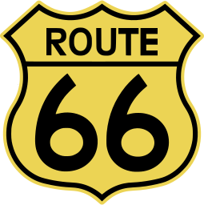

# Route66
### Easy, small, hash-based JS vanilla page router
## History
I don't really fancy the idea of elaborate frameworks in my frontend, I always prefer keeping my webapps very slim with vanilla HTML-CSS-JS.
Single-page apps always seemed interesting to me, and I took the opportunity to bundle the routing view logic you would find in something like Vue Router in a distilled manner and using hashes instead of URL paths.

## Why hashes instead of paths?
I found navigating through hashes makes the frontend server-side agnostic, as you would only need a file server to serve the HTML page and all the CSS/JS, without making the server ignore special routes handled by your frontend.
Also, hashes appear in your Browser History, just as URL paths do.

## Seems really crude to me...
Indeed it is. I tried to boil it down to 50 lines or so, making it very small and lightweight (only ~0.5KB minified+gzipped).
You could look at the code without feeling dizzy, which is something rarely seen in modern codebases.

## Build
needs `uglifyjs` to bundle the minified version
```sh
$ make
```

## Import
Source the `route66.min.js` file as a script. No NPM needed.
```html
	<script src="route66.min.js" defer></script>
```

## How to use
You start by defining any element with an empty `route` attribute and a unique `id`.
```html
<section route id="start">
	<h1>Hello world!</h1>
	<h3>This is the main route.</h3>
<section>
```
This is what you would call a `View` in other frameworks.
You can add more views to one page just like so:
```html
<section route title="Main page" id="start">
	<h1>Hello world!</h1>
	<h3>This is the main route.</h3>
	<a href="#second">Go to the second page?</a>
<section>
<section route title="Second page" id="second">
	<h1>Wassup</h1>
	<h3>This is the second route.</h3>
	<a href="#start">Go back?</a>
<section>
```

We've now implemented 2 pages in our SPA. We now need to tinker with JS to make it work.
```js
document.addEventListener("DOMContentLoaded", _ => { R.init() });
```
This is the bare minimum to make it work. As you can see, it also changes the page title according to the `title` attribute within the View. The router also adds a `selected` class to the currently selected view (for further CSS styling).

## JavaScript API
The Library offers a simple API, with the globally defined `R` object having only 4 methods:
  + `R.init(?displayStyle)`: initialize the router. You can pass the CSS display style of the selected view as a parameter. Defaults to `block`.
  + `R.on(hash, callback)`: execute a callback when the user is on a certain view. This may be used to update the View itself with information fetched from the backend. The `HTMLElement` of the View is passed to the callback if it exists, otherwise `null`.
  + `R.go(hash)`: navigate to the corresponding View on the page (if it exists). It also fires any event attached with `R.on`.
  + `R.re(hash)`: redirect to the corresponding View. Same as `R.go` but overwrites the current Browser History with the new route.

## Example
You can see a complete example in the `example` directory.
